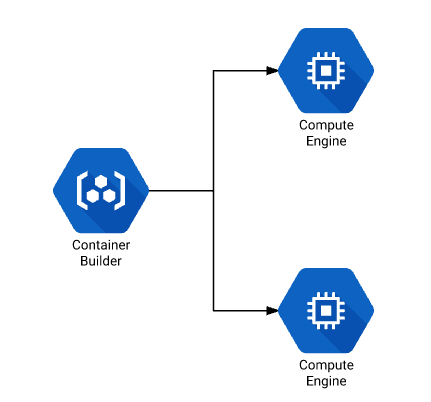

# Cloud Build Remote Build Step

## Introduction



Some continuous integration workloads require special builder types. You may
require things like:

1.  High CPU/Memory machines
1.  Custom image
1.  GPUs attached
1.  Fast or large disks
1.  Machines in a particular network
1.  Pre-emptibility

In these cases you can leverage Cloud Build to trigger your builds and manage
their workflow but run the actual build steps on an instance with exactly the
configuration you need.

## How?

When using the remote-builder image, the following will happen:

1.  A temporary SSH key will be created in your Cloud Build workspace
1.  A instance will be launched with your configured flags
1.  The workpace will be copied to the remote instance
1.  Your command will be run inside that instance's workspace
1.  The workspace will be copied back to your Cloud Build workspace

## Usage

In order to use this step, first build the builder:

```
gcloud container builds submit --config=cloudbuild.yaml .
```

Then, create an appropriate IAM role with permissions to create and destroy
Compute Engine instances in this project:

```
export PROJECT=$(gcloud info --format='value(config.project)')
export PROJECT_NUMBER=$(gcloud projects describe $PROJECT --format 'value(projectNumber)')
export CB_SA_EMAIL=$PROJECT_NUMBER@cloudbuild.gserviceaccount.com
gcloud services enable cloudbuild.googleapis.com
gcloud services enable compute.googleapis.com
gcloud projects add-iam-policy-binding $PROJECT --member=serviceAccount:$CB_SA_EMAIL --role='roles/iam.serviceAccountUser' --role='roles/compute.instanceAdmin.v1' --role='roles/iam.serviceAccountActor'
```

Then, configure your build step as follows:

```
steps:
- name: gcr.io/$PROJECT_ID/remote-builder
  env:
    - COMMAND=ls -la
```

This will launch an instance with the default parameters and then run the
command `ls -la` inside the instance's workspace.

## Configuration

The following options are configurable via environment variables passed to the
build step in the `env` parameter:

| Options          | Description              | Default                        |
| ---------------- | ------------------------ | ------------------------------ |
| COMMAND          | Command to run inside    | None, must be set              |
:                  : the remote workspace     :                                :
| USERNAME         | Username to use when     | `admin`                        |
:                  : logging into the         :                                :
:                  : instance via SSH         :                                :
| REMOTE_WORKSPACE | Location on remote host  | `/home/${USERNAME}/workspace/` |
:                  : to use as workspace      :                                :
| INSTANCE_NAME    | Name of the instance     | `builder-$UUID`                |
:                  : that is launched         :                                :
| ZONE             | Compute zone to launch   | `us-central1-f`                |
:                  : the instance in          :                                :
| INSTANCE_ARGS    | Parameters to the        | `--preemptible`                |
:                  : instance creation        :                                :
:                  : command. For a full list :                                :
:                  : run `gcloud compute      :                                :
:                  : instances create --help` :                                :

To give it a try, see the
[examples directory](https://github.com/GoogleCloudPlatform/cloud-builders-community/tree/master/remote-builder/examples).

This is not an official Google product.

## Trade-offs

1.  Paying for builder + VM
2.  Spin up time of VM increases build time
